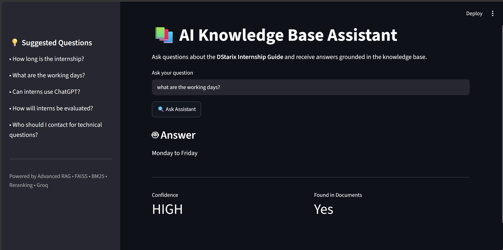
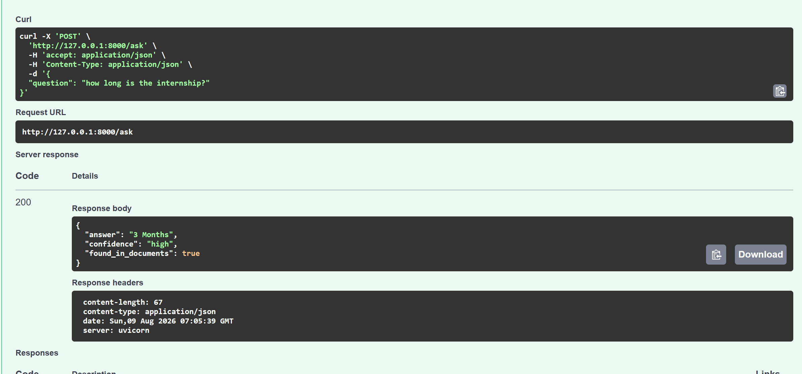

# AI Knowledge Base Assistant

A production-ready Retrieval-Augmented Generation (RAG) assistant designed to answer questions about the **DStarix Internship Guide** (PDF document). It processes user queries, rewrites them for optimal vector search, performs hybrid search combining sparse and dense retrievers, reranks retrieved documents, and applies strict response guardrails using Llama-3.3-70b-versatile via Groq to prevent hallucinations.

---

## Features

- **Query Rewriting / Expansion**: Rewrites raw queries to improve RAG performance using `llama-3.3-70b-versatile` via ChatGroq.
- **Hybrid Retrieval**: Combines FAISS vector search (dense retriever using HuggingFace sentence-transformers) and BM25 (sparse keyword retriever) to fetch highly relevant document chunks.
- **Cross-Encoder Reranking**: Uses a cross-encoder model (`cross-encoder/ms-marco-MiniLM-L-6-v2`) to compute relevance scores and filter retrieval results.
- **Response Guardrails**: Prompts the LLM with strict contextual constraints to prevent hallucinations, formatting outputs into structured confidence ratings.
- **Streamlit Web Interface**: A sleek, user-friendly frontend dashboard with suggested questions, and real-time query processing feedback.
- **FastAPI Backend**: A performant API service exposing validated endpoints (`/ask`), structured requests/responses, logging, and error handling.
- **CLI Mode**: Run direct command-line queries against the retriever and response generator.

---

## Technologies Used

- **Framework**: FastAPI (Backend API), Streamlit (Frontend UI)
- **RAG & Orchestration**: LangChain, LangChain Community, LangChain HuggingFace
- **Vector Store & Indexing**: FAISS (Facebook AI Similarity Search)
- **Sparse Store**: BM25
- **LLM Provider**: Groq API (`llama-3.3-70b-versatile`)
- **Embeddings**: `sentence-transformers/all-MiniLM-L6-v2`
- **Reranker Model**: `cross-encoder/ms-marco-MiniLM-L-6-v2`
- **Document Loading**: PyPDFLoader
- **Language**: Python 3.10+

---

## Installation Instructions

1. **Clone the Repository**:
   ```bash
   git clone https://github.com/Samyuktha13-06/DStarix_week5_ai_knowlegde_base_assistant.git
   cd DStarix_week5_ai_knowlegde_base_assistant
   ```

2. **Create and Activate a Virtual Environment**:
   - **Windows (PowerShell)**:
     ```powershell
     python -m venv venv
     .\venv\Scripts\Activate.ps1
     ```
   - **Linux / macOS**:
     ```bash
     python3 -m venv venv
     source venv/bin/activate
     ```

3. **Install Dependencies**:
   ```bash
   pip install --upgrade pip
   pip install -r requirements.txt
   ```

---

## Setup Instructions

1. **Create Environment Variables File**:
   Create a `.env` file in the root directory based on the `.env.example` template:
   ```env
   GROQ_API_KEY=your_groq_api_key_here
   ```

2. **Knowledge Base Document**:
   Ensure the rule book PDF document is placed in the `documents/` folder:
   - File Path: `documents/Internship Rule Book.pdf`

---

## Usage Guide

### 1. Running the FastAPI Backend
Start the FastAPI server using Uvicorn:
```bash
uvicorn api.main:app --reload
```
The API server will run at `http://127.0.0.1:8000`. You can access the interactive Swagger documentation at `http://127.0.0.1:8000/docs`.

### 2. Running the Streamlit Frontend
In a separate terminal (with the virtual environment activated), start the Streamlit web dashboard:
```bash
streamlit run app.py
```
This opens the frontend interface at `http://localhost:8501`.

### 3. Running the CLI
To query the system directly from the terminal without starting the web servers:
```bash
python cli.py
```

---

## Project Structure

```
ai_knowledge_base_assistant/
├── api/
│   └── main.py                     # FastAPI application endpoints
├── assets/
│   └── screenshots/                # Application UI & execution screenshots
├── documents/
│   └── Internship Rule Book.pdf    # Source PDF knowledge base
├── loaders/
│   └── document_loader.py          # PDF document loader & text splitter
├── prompts/
│   ├── prompt_template.py          # Base prompt templates
│   └── query_transform.py          # Query rewriting prompt templates
├── retrieval/
│   ├── bm25_store.py               # Sparse keyword search store
│   ├── faiss_store.py              # Dense vector search store
│   ├── hybrid_search.py            # HybridRetriever implementation
│   └── reranker.py                 # Cross-encoder reranking module
├── utils/
│   ├── answer_generator.py         # LLM response generation
│   ├── guardrails.py               # Guardrail prompts & rules
│   ├── llm.py                      # LLM configuration via ChatGroq
│   ├── logger.py                   # Custom logger helper
│   └── schema.py                   # FastAPI request/response schema types
├── app.py                          # Streamlit application UI
├── cli.py                          # Command-line interface application
├── requirements.txt                # Python package list
├── .env                            # Environment configurations (API keys)
└── README.md                       # Project documentation
```

---

## Sample Questions

Here are some suggested sample questions to test the assistant:

- **Internship Duration & Timeline**:
  - *"How long is the internship?"*
  - *"What is the duration of the training program?"*
- **Working Schedule**:
  - *"What are the working days?"*
  - *"Do we have to work on weekends?"*
- **AI Tool Usage Policy**:
  - *"Can interns use ChatGPT?"*
  - *"What is the policy regarding AI coding assistants?"*
- **Performance & Evaluation**:
  - *"How will interns be evaluated?"*
  - *"What criteria are used to assess my internship performance?"*
- **Points of Contact**:
  - *"Who should I contact for technical questions?"*
  - *"Who is the supervisor or POC for HR queries?"*

---

## Example Outputs

### Frontend Dashboard


### FastAPI Backend Console logs & queries

